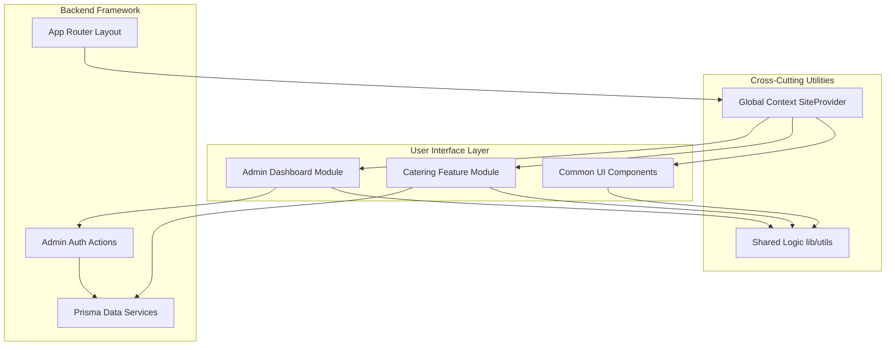

# Component Library

The application is built using a modular component architecture based on React and Tailwind CSS.

## Component Diagram

---

## Core Site Components (`/src/components`)

### 1. `Navbar`
The main navigation header.
- **Features**: Responsive mobile menu, glassmorphism background, active link tracking.
- **Props**: None (uses global navigation config).

### 2. `SignatureDishes`
A grid of featured items on the homepage.
- **Features**: Hover effects, Framer Motion staggered "entrance" animations.
- **Data**: Hardcoded in `src/data/menu.ts`.

### 3. `Location`
Displays the truck's current and upcoming stops.
- **Features**: Conditional rendering based on "Today's Status", Google Maps deep linking.
- **Data**: Consumes `SiteProvider` context.

### 4. `SiteProvider`
A React Context provider that wraps the entire application.
- **Role**: Fetches and provides `SiteSettings` (business name, phone, etc.) to all child components.
- **Cache**: Revalidates every 3600 seconds.

---

## Catering Module Components (`/src/app/catering/ui`)

### 1. `CateringItemDrawer`
A slide-over panel for customizing a catering item selection.
- **Props**:
  - `item`: `CateringItem` (The item being customized).
  - `onAdd`: `(selection) => void` (Callback for the parent summary).
- **Features**:
  - **Logic**: Handles "Half Tray" vs "Full Tray" pricing.
  - **Validation**: Enforces `minPeople` for packages.

### 2. `CateringSelectionSummary`
A sticky drawer that tracks the customer's current quote request.
- **Props**: `selections`, `onRemove`, `onSubmit`.
- **Features**: Real-time total calculation and "Ready to Send" form summary.

### 3. `CateringPrintedMenu`
A specialized view for the "Download Menu" feature.
- **Features**: CSS `@media print` rules to ensure headers and footers appear only on paper/PDF.

---

## Admin UI Components (`/src/app/admin/ui`)

### 1. `CateringAvailabilityToggle`
A global switch for the admin dashboard.
- **Role**: Disables the public catering submission API and shows a "Maintenance" banner to customers.

### 2. `LogoutButton`
Securely clears the `auth_token` and redirects to the landing page.

---

## Animation Layer (`Reveal.tsx`)
A utility wrapper using **Framer Motion**.
- **Usage**: `<Reveal>
Content
</Reveal>`
- **Behavior**: Fades in and slides up elements when they enter the viewport.
