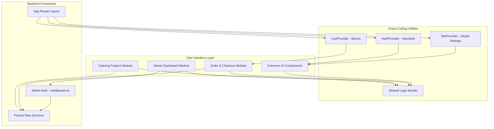

# Component Library

The application is built using a modular component architecture based on React 19 and Tailwind CSS.

## Component Diagram

---

## Core Site Components (`/src/components`)

### `Navbar`
The main navigation header present on all customer-facing pages.
- **Features**: Responsive mobile menu, glassmorphism background, active link detection via IntersectionObserver, cart icon with live item count and total, user profile link when authenticated.
- **Data**: Consumes `CartProvider` and `AuthProvider`.

### `CartDrawer`
A slide-over panel for reviewing and editing cart contents before checkout.
- **Features**: Lists all items with quantity controls, shows subtotal, triggers checkout flow.
- **Data**: Consumes `CartProvider`. Calls `POST /api/orders` to initialize checkout.

### `CheckoutForm`
The Stripe Elements payment form rendered inside the checkout page.
- **Features**: Card input via Stripe Elements, displays order breakdown (subtotal, tax, total), handles payment confirmation and error states.

### `Hero`
The full-screen homepage hero section.
- **Features**: Animated headline with GSAP/Framer Motion, truck status indicator, CTA buttons.

### `SignatureDishes`
A grid of featured/popular menu items on the homepage.
- **Features**: Staggered Framer Motion entrance animations, hover effects with price overlay.
- **Data**: Fetches popular items from `MenuItem` table.

### `Location`
Displays the truck's current and upcoming stops.
- **Features**: Conditional rendering based on `todayStatus`, Google Maps deep linking, today/next-stop tabs.
- **Data**: Consumes `SiteProvider` context.

### `InstagramGrid`
Visual grid linking to the truck's Instagram feed.
- **Features**: Placeholder grid with Instagram link CTA.

### `Footer`
Site-wide footer with navigation, contact, and operating hours.
- **Features**: Dynamic content from `SiteProvider`, hidden on admin routes, catering CTA card, social links, copyright year.

### `AnnouncementBanner`
A dismissible top-of-page banner for important announcements.
- **Features**: Conditionally renders based on `bannerEnabled` in site settings. Content editable from admin.

### `SiteProvider`
Root React Context provider for global site configuration.
- **Role**: Fetches `SiteSettings` server-side in `layout.tsx` and injects into context. All components access it via `useSite()`.

### `AuthProvider`
Wraps the application with NextAuth's `SessionProvider` for client-side session access.

### `OrderChat`
Real-time chat interface between customer and admin on the order tracking page.
- **Features**: Polls for new messages, displays CUSTOMER/ADMIN messages with distinct styling, input for sending new messages.

### `OrderTrackingList`
Displays a user's order history with status badges and tracking links (used on profile page).

### `OrderModal`
Modal for displaying detailed order information.

### `MenuTabs`
The main menu page component with category tab navigation and item grid.
- **Features**: Category filtering, add-to-cart per item, dietary badges (Veg, Spicy, Popular).

### `StickyCall`
A persistent floating CTA button for quick phone contact (shown on the menu page).

### `WhyUs`
A homepage section highlighting the food truck's unique selling points.

### `GlassSurface`
A reusable glassmorphism card container component.
- **Features**: Configurable blur, border, and glow effects.

### `SpotlightCard`
A card with a spotlight/glow effect that follows mouse cursor position.

### `Reveal`
A utility animation wrapper using Framer Motion.
- **Usage**: `<Reveal>
Content
</Reveal>`
- **Behavior**: Fades in and slides up when the element enters the viewport.

### `SplitText`
A text animation component that reveals text character-by-character or word-by-word.

### `Magnet`
A magnetic hover effect wrapper — child element follows the cursor when hovered.

### `DotGrid`
A decorative animated dot grid background component.

### `TimePicker`
A custom time picker input component used in the admin schedule manager.

### `PillNav`
A pill-shaped tab navigation component used in the admin panel.

---

## Catering Module Components (`/src/app/catering/ui`)

### `CateringItemDrawer`
A slide-over panel for customizing a catering item selection.
- **Props**: `item: CateringItem`, `onAdd: (selection) => void`
- **Features**: Handles "Half Tray" vs "Full Tray" pricing, enforces `minPeople` for packages, quantity controls.

### `CateringSelectionSummary`
A sticky bottom drawer tracking the customer's current catering quote.
- **Props**: `selections`, `onRemove`, `onSubmit`
- **Features**: Real-time total calculation, event inquiry form, submission to `/api/catering`.

### `CateringPrintedMenu`
A print-optimized view of the catering menu.
- **Features**: CSS `@media print` rules — hides nav, dark backgrounds, and gradients; shows high-contrast black-on-white layout.

---

## Admin UI Components (`/src/app/admin`)

### `AdminOrderChat`
Chat interface in the admin orders panel for communicating with customers.

### `OrderStatusActions` / `OrderStatusSelect`
Controls for updating order status from the admin dashboard.

### `CateringClient`
Main client component for the admin catering inbox — handles filtering, sorting, and state.

### `CateringRequestCard`
Individual catering request card in the admin inbox.

### `CateringDetailsDrawer`
Slide-over panel showing full catering request details, chat, and status controls.

### `AdminChatDrawer`
Admin-side chat interface for catering request threads.

### `FiltersBar`
Filter and sort controls for the catering inbox.

### `CateringAvailabilityToggle`
A global switch that enables/disables public catering submissions.

### `LogoutButton`
Clears the admin JWT cookie and redirects to the login page.
