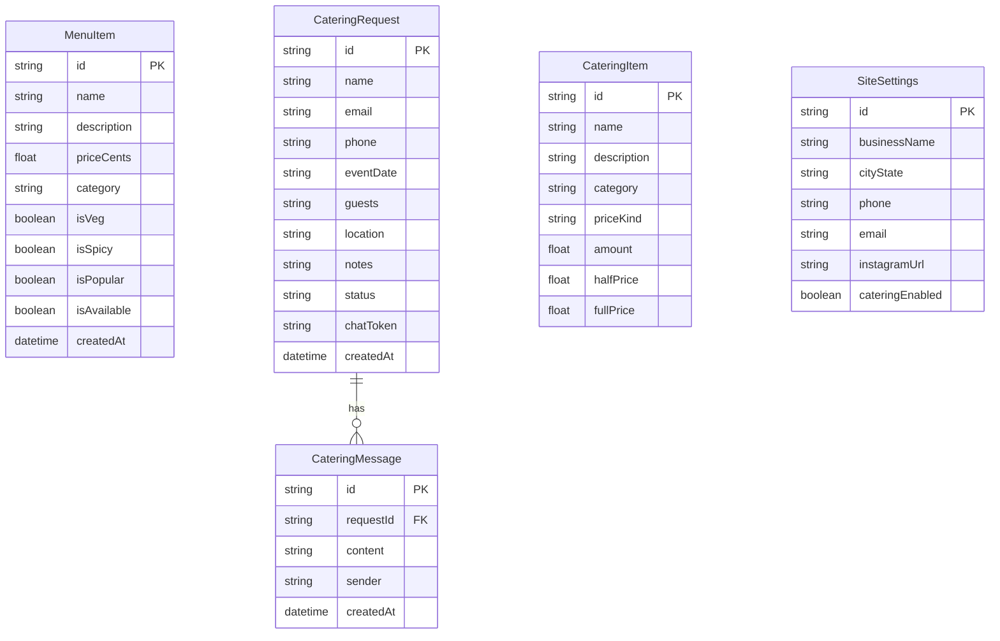

# Database Design

## Entity Relationship Diagram

---

## Main Tables

### MenuItem Table
Stores items for the public food truck menu.

### CateringRequest Table
Stores incoming catering inquiries and their current status.

### CateringItem Table
Stores professional catering menu offerings (packages, trays, etc.).

### SiteSettings Table
Stores global configuration for the truck (branding, contact info, toggles).
