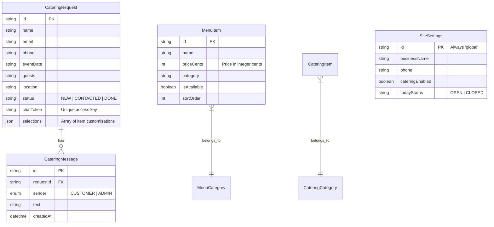

# Database Design

The application uses **PostgreSQL** (hosted on Supabase) with **Prisma ORM** for type-safe data access.

---

## Entity Relationship Diagram

---

## Detailed Data Models

### 1. `CateringRequest` & `CateringMessage`
- **Relationship**: One-to-Many.
- **Cascading**: Deleting a `CateringRequest` will automatically delete all associated `CateringMessage` records.
- **Token Access**: The `chatToken` allows customers to access their specific discussion thread without a full user account.

### 2. `MenuItem`
- **Price Handling**: Prices are stored as `Int` (priceCents) to avoid floating-point math issues.
- **Optimization**: Indexes are applied to `category`, `isAvailable`, and `sortOrder` for fast menu rendering.

### 3. `CateringItem`
- **Variability**: Uses a `priceKind` field ("PER_PERSON", "TRAY", "FIXED") to handle different pricing structures in the same table.
- **Fields**: `halfPrice` and `fullPrice` are specific to the "TRAY" kind.

### 4. `SiteSettings`
- **Global Singleton**: The application logic strictly uses the record with `id: "global"` to fetch site-wide configuration.
- **Advanced Scheduling**: Includes individual fields for `todayStart`, `todayEnd`, and `todayLocation` to provide precise info to the `Location` component.
