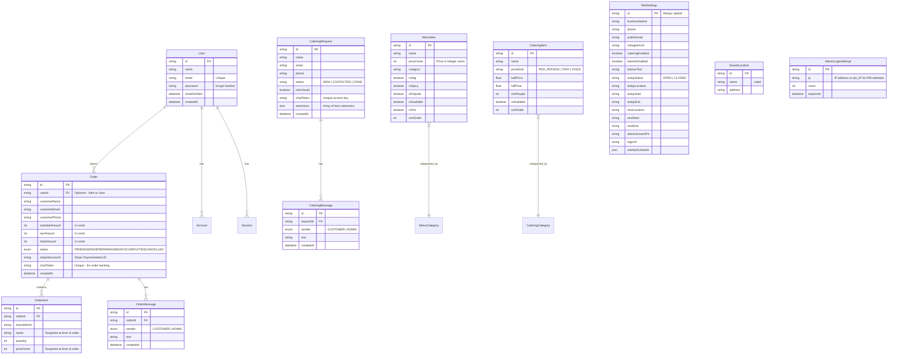

# Database Design

## Entity Relationship Diagram

---

## Detailed Data Models

### 1. `User`, `Account`, `Session`, `VerificationToken`
These models are managed by **NextAuth.js** via the Prisma adapter. They handle customer authentication.
- `User` stores email/password (bcrypt-hashed) and links to all their orders.
- `Account` and `Session` support NextAuth's OAuth and session management.
- Deleting a `User` cascades to their `Account` and `Session` records.

### 2. `Order` & `OrderItem`
- **Price snapshots**: `OrderItem.priceCents` and `name` are copied from the menu at the time of ordering. This means historical orders remain accurate even if menu prices change later.
- **Server-side verification**: The API fetches live prices from the DB before creating the order — client-submitted prices are ignored entirely.
- **Tracking**: Each order has a `chatToken` (UUID) that links to the public tracking page `/track/[token]`.
- **Stripe link**: `stripeSessionId` stores the Stripe PaymentIntent ID for reconciliation.
- **Status flow**: `PENDING` → `PAID` (via webhook) → `PREPARING` → `READY` → `COMPLETED` (admin updates).

### 3. `OrderMessage`
- Real-time chat between the customer (via tracking token) and admin (via admin dashboard).
- Cascades on order deletion.
- Indexed on `[orderId, createdAt]` for efficient message retrieval.

### 4. `CateringRequest` & `CateringMessage`
- **Relationship**: One-to-Many. Deleting a `CateringRequest` cascades to all its messages.
- **Token Access**: The `chatToken` allows customers to access their discussion thread at `/catering/chat/[token]` without needing an account.
- **Selections**: Stored as JSON for flexible item configuration without schema migrations.

### 5. `MenuItem`
- Prices stored as `Int` (cents) to avoid floating-point precision issues.
- Indexed on `[category, isAvailable, sortOrder]` for fast public menu rendering.
- `inPos` controls whether the item appears in the point-of-sale ordering flow.

### 6. `CateringItem`
- Uses `priceKind` (`PER_PERSON`, `TRAY`, `FIXED`) to handle different pricing structures in one table.
- `halfPrice` and `fullPrice` apply to the `TRAY` kind.
- `minPeople` enforces minimum guest counts for packages.

### 7. `SiteSettings`
- **Global singleton**: Always accessed with `id: "global"`.
- Exposed to the frontend via `SiteProvider` context (with sensitive fields like `adminAccessPin` stripped out by the public API route).
- `weeklySchedule` stored as JSON for flexible schedule configuration.

### 8. `AdminLoginAttempt`
- Powers the database-backed rate limiting on the admin login and PIN verification endpoints.
- Uses a `pin_` prefix on the `ip` field to separate PIN attempts from password attempts.
- Expired records are cleaned up asynchronously on each login request.
- Indexed on `[ip, expiresAt]` for fast lookups.
