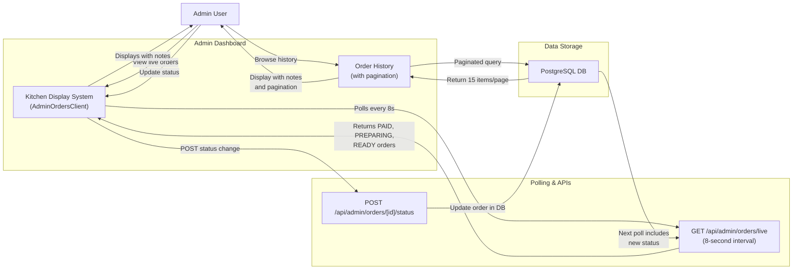
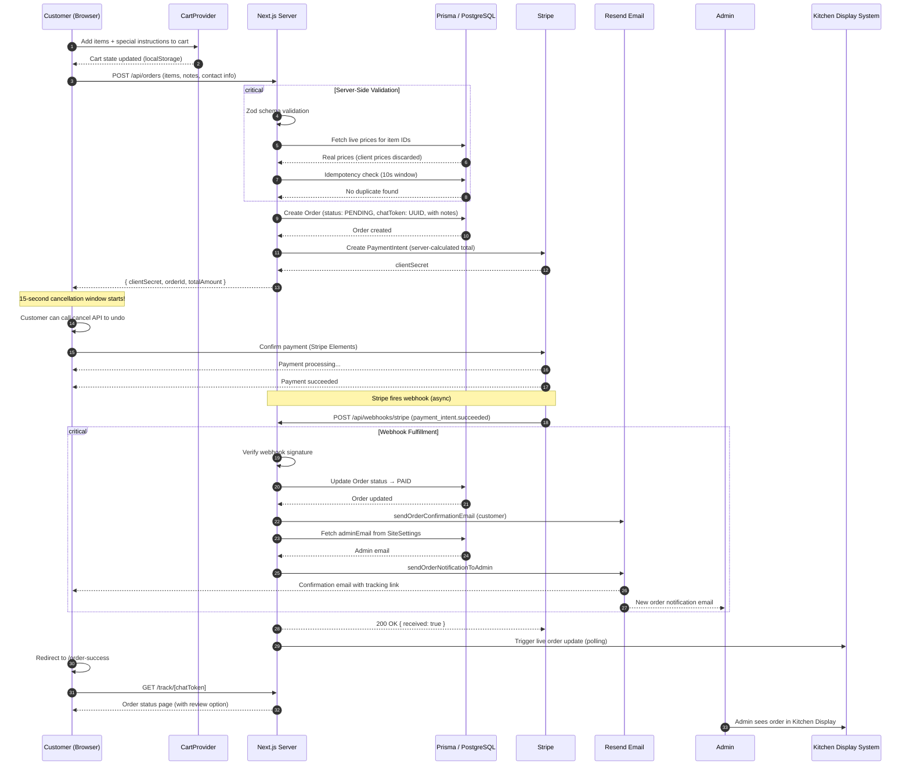
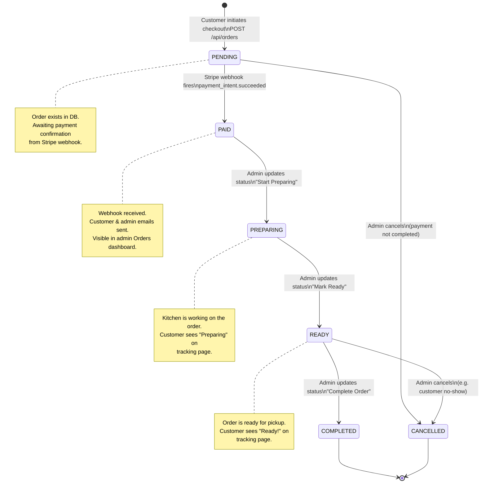

# Data Flow

This document outlines how data is fetched, managed, and synchronized across the system.

## Data Flow Diagram (Level 1 - Order & Operations)

```mermaid
graph LR
    subgraph "External Entities"
        U[Customer]
        A[Admin]
        S[Stripe]
    end

    subgraph "System Processes"
        P1[Order Processing]
        P2[Catering Inquiry]
        P3[Menu/Item Sync]
        P4[Schedule Management]
        P5[Email / Chat Service]
        P6[Webhook Handler]
        P7[Review Moderation]
        P8[Analytics Engine]
    end

    subgraph "Data Storage"
        D1[(PostgreSQL DB)]
    end

    U -->|Add to cart, checkout| P1
    P1 -->|Create PaymentIntent| S
    S -->|payment_intent.succeeded| P6
    P6 -->|Mark Order PAID| D1
    P6 -->|Trigger| P5
    P5 -->|Confirmation email + Admin alert| U
    P5 -->|Admin notification| A

    U -->|Catering selections| P2
    P2 -->|Save request| D1
    P2 -->|Trigger| P5
    P5 -->|Chat link email| U

    U -->|Submit review| P7
    P7 -->|Save review (pending approval)| D1
    A -->|Approve/Reject| P7
    P7 -->|Update review status| D1

    A -->|View analytics| P8
    P8 -->|Query orders, items, revenue| D1
    D1 -->|Analytics data| P8
    P8 -->|Dashboard display| A

    A -->|Update item| P3
    P3 -->|Update records| D1

    A -->|Set location| P4
    P4 -->|Save schedule| D1

    D1 -->|Read settings + menu| P1
    D1 -->|Read settings| P2
```

---

## Data Flow Diagram (Level 2 - Admin Kitchen Operations)



---

## 1. Global State Management (`SiteProvider`)

The application avoids complex state libraries in favor of a clean React Context pattern for global configuration.

The flow:
1. **Server-Side Fetch**: The root `layout.tsx` performs a Prisma query to get `SiteSettings` on every request.
2. **Bootstrapping**: The layout wraps children in `<SiteProvider settings={data}>`.
3. **Consumption**: Any client component (Navbar, Footer, Location) calls `useSite()` to access branding, contact info, and truck status.
4. **Fallback**: If the DB query fails or returns null, the context falls back to default values.

---

## 2. Online Order Lifecycle

### Sequence Diagram — Online Order Flow



When a customer places an order:

1. **Cart**: Customer adds items in `CartDrawer`. Cart state is managed in `CartProvider` with localStorage persistence (keyed by user email if logged in).
2. **Checkout**: Customer fills in contact details. `POST /api/orders` is called.
3. **Server Validation**:
   - Zod schema validates the request body.
   - Item prices are fetched from the **database** — client-submitted prices are ignored.
   - Idempotency check: blocks duplicate orders within 10 seconds.
4. **Order Created**: A `PENDING` order is saved to the DB with a secure `chatToken` (UUID).
5. **Stripe PaymentIntent**: Created with the server-calculated total. `clientSecret` returned to the browser.
6. **Payment**: Customer completes card entry in the Stripe Elements form.
7. **Webhook**: Stripe sends `payment_intent.succeeded` to `/api/webhooks/stripe`.
8. **Fulfillment**:
   - Order status updated to `PAID`.
   - Customer confirmation email sent with tracking link.
   - Admin notification email sent.
9. **Tracking**: Customer is redirected to `/order-success`, then can visit `/track/[token]` to follow status.

---

## 3. Catering Request Lifecycle

When a customer submits a catering inquiry:

1. **Selection**: Customer picks items in `CateringPage`. State managed locally.
2. **POST Request**: Selections + event form data sent to `/api/catering`.
3. **Processing**:
   - Zod schema validation.
   - `cateringEnabled` check in DB.
   - Honeypot trap and rate limiting (3 requests per 15 min per IP).
4. **Persistence**: `CateringRequest` record created with a unique `chatToken`.
5. **Email**: Confirmation email sent to customer with a direct link to `/catering/chat/[token]`.
6. **Chat**: Admin replies via the catering inbox. Customer receives messages via their chat link.

---

## 4. Administrative Updates & Sync

When an admin modifies a menu item or site setting, Next.js cache revalidation ensures instant updates.

Revalidation strategy:
- Admin API handlers (e.g., `DELETE /api/admin/menu-items/[id]`) call `revalidatePath('/menu')` and `revalidatePath('/admin/menu-items')`.
- This clears the Next.js data cache for those routes, so both the customer menu and admin dashboard show fresh data immediately.

---

## 5. Order Status State Machine



## 7. Order Chat & Catering Chat Synchronization

Both chat systems follow the same pattern:

- **Retrieval**: `GET /api/[type]/[id]/messages` returns full message history.
- **Role Detection**: Sender identified as `ADMIN` (via JWT cookie) or `CUSTOMER` (via chat token in request).
- **Update**: New messages appended to `OrderMessage` or `CateringMessage` tables.
- **Polling**: Client components poll the messages endpoint periodically (custom intervals) to show new messages without requiring WebSockets.

---

## 8. Live Kitchen Display System (Admin Orders Polling)

When an admin views the kitchen dashboard:

1. **AdminOrdersClient Component** mounts and initiates polling.
2. **8-Second Polling**: Client calls `GET /api/admin/orders/live` every 8 seconds.
3. **API Response**: Returns orders in statuses NEW, PREPARING, READY with:
   - Order details (ID, customer name, phone, total)
   - OrderItems with menu item names and quantities
   - **Special Instructions**: Order-level notes and per-item notes
4. **Kanban Display**: Orders are organized into 3 columns: NEW → PREPARING → READY.
5. **Real-Time Updates**: As customers place orders or status changes, the next poll reflects the new state.
6. **Manual Updates**: Admin can update status via `POST /api/admin/orders/[id]/status` which triggers the next poll refresh.
7. **Note Visibility**: Kitchen staff see all special instructions in the order card for food preparation accuracy.

---

## 9. Password Reset Flow

When a customer forgets their password:

1. **Request Reset**: Customer submits email to `/auth/forgot-password`.
2. **Token Generation**: System generates a unique, time-limited reset token.
3. **Email Sent**: Resend sends email with reset link (e.g., `/auth/reset-password?token=xxx`).
4. **Token Validation**: When customer clicks link, system validates token expiration.
5. **Password Update**: Customer submits new password to `/api/auth/reset-password`.
6. **Confirmation**: Token is invalidated, password is bcrypt-hashed and saved.
7. **Session**: Customer can now log in with new password.

---

## 10. Customer Review Submission Flow

After order completion:

1. **Review Trigger**: Customer sees "Rate Your Order" button on tracking page or in profile order history.
2. **Review Form**: Customer submits 1-5 star rating + optional comment.
3. **Save to DB**: Review record created with `isApproved: false`.
4. **Admin Moderation**: Admin reviews submission in `/admin/reviews` dashboard.
5. **Approval**: Admin can approve, reject, or delete review.
6. **Display**: Only approved reviews appear on homepage in the "Customer Reviews" section.
7. **Visibility**: Review shows customer name, rating, and comment (if approved).

---

## 11. Order Cancellation (15-Second Window)

When customer places an order:

1. **Immediate**: Order is created with `status: PENDING`.
2. **Cancellation Window**: Customer has 15 seconds to cancel.
3. **Action**: Customer can call `POST /api/orders/[id]/cancel`.
4. **Effect**: Order status changes to `CANCELLED` before webhook processes.
5. **Outcome**: Stripe payment is never initiated; customer sees cancellation confirmation.
6. **After 15 Seconds**: Window closes; order proceeds to payment processing via Stripe.

---

## 6. Authentication Flow (Customer)

1. Customer submits email/password to NextAuth's credentials provider.
2. NextAuth verifies the password with bcrypt, creates a JWT session.
3. Session is accessible via `getServerSession()` in server components and API routes.
4. `userId` is injected into the JWT token for use in protected endpoints.
5. On logout, the session is cleared and cart switches back to guest state.
