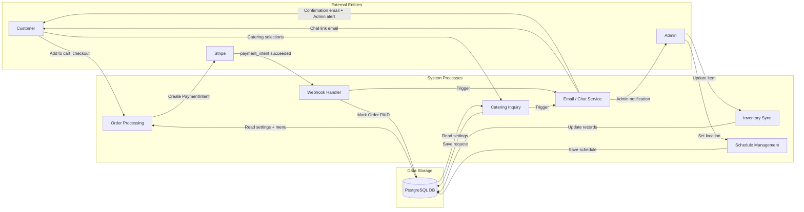

# Data Flow

This document outlines how data is fetched, managed, and synchronized across the system.

## Data Flow Diagram (Level 1)

---

## 1. Global State Management (`SiteProvider`)

The application avoids complex state libraries in favor of a clean React Context pattern for global configuration.

The flow:
1. **Server-Side Fetch**: The root `layout.tsx` performs a Prisma query to get `SiteSettings` on every request.
2. **Bootstrapping**: The layout wraps children in `<SiteProvider settings={data}>`.
3. **Consumption**: Any client component (Navbar, Footer, Location) calls `useSite()` to access branding, contact info, and truck status.
4. **Fallback**: If the DB query fails or returns null, the context falls back to default values.

---

## 2. Online Order Lifecycle

When a customer places an order:

1. **Cart**: Customer adds items in `CartDrawer`. Cart state is managed in `CartProvider` with localStorage persistence (keyed by user email if logged in).
2. **Checkout**: Customer fills in contact details. `POST /api/orders` is called.
3. **Server Validation**:
   - Zod schema validates the request body.
   - Item prices are fetched from the **database** — client-submitted prices are ignored.
   - Idempotency check: blocks duplicate orders within 10 seconds.
4. **Order Created**: A `PENDING` order is saved to the DB with a secure `chatToken` (UUID).
5. **Stripe PaymentIntent**: Created with the server-calculated total. `clientSecret` returned to the browser.
6. **Payment**: Customer completes card entry in the Stripe Elements form.
7. **Webhook**: Stripe sends `payment_intent.succeeded` to `/api/webhooks/stripe`.
8. **Fulfillment**:
   - Order status updated to `PAID`.
   - Customer confirmation email sent with tracking link.
   - Admin notification email sent.
9. **Tracking**: Customer is redirected to `/order-success`, then can visit `/track/[token]` to follow status.

---

## 3. Catering Request Lifecycle

When a customer submits a catering inquiry:

1. **Selection**: Customer picks items in `CateringPage`. State managed locally.
2. **POST Request**: Selections + event form data sent to `/api/catering`.
3. **Processing**:
   - Zod schema validation.
   - `cateringEnabled` check in DB.
   - Honeypot trap and rate limiting (3 requests per 15 min per IP).
4. **Persistence**: `CateringRequest` record created with a unique `chatToken`.
5. **Email**: Confirmation email sent to customer with a direct link to `/catering/chat/[token]`.
6. **Chat**: Admin replies via the catering inbox. Customer receives messages via their chat link.

---

## 4. Administrative Updates & Sync

When an admin modifies a menu item or site setting, Next.js cache revalidation ensures instant updates.

Revalidation strategy:
- Admin API handlers (e.g., `DELETE /api/admin/menu-items/[id]`) call `revalidatePath('/menu')` and `revalidatePath('/admin/menu-items')`.
- This clears the Next.js data cache for those routes, so both the customer menu and admin dashboard show fresh data immediately.

---

## 5. Order Chat & Catering Chat Synchronization

Both chat systems follow the same pattern:

- **Retrieval**: `GET /api/[type]/[id]/messages` returns full message history.
- **Role Detection**: Sender identified as `ADMIN` (via JWT cookie) or `CUSTOMER` (via chat token in request).
- **Update**: New messages appended to `OrderMessage` or `CateringMessage` tables.
- **Polling**: Client components poll the messages endpoint periodically to show new messages without requiring WebSockets.

---

## 6. Authentication Flow (Customer)

1. Customer submits email/password to NextAuth's credentials provider.
2. NextAuth verifies the password with bcrypt, creates a JWT session.
3. Session is accessible via `getServerSession()` in server components and API routes.
4. `userId` is injected into the JWT token for use in protected endpoints.
5. On logout, the session is cleared and cart switches back to guest state.
