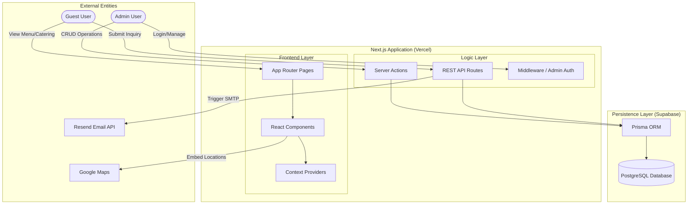
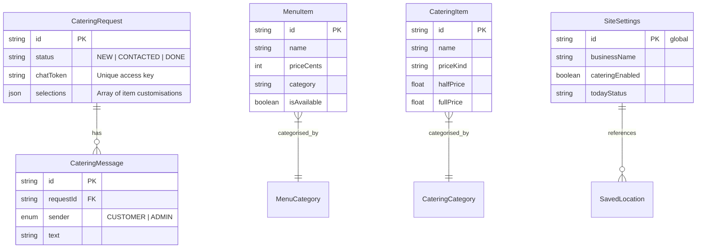
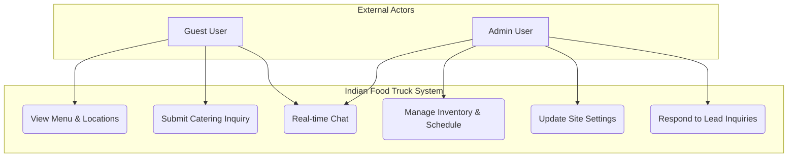
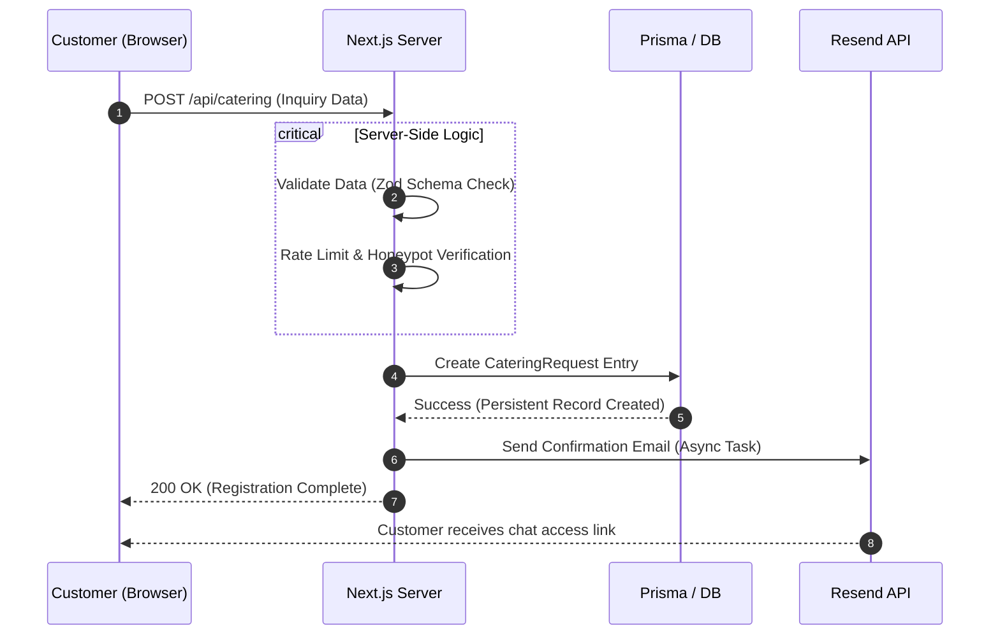
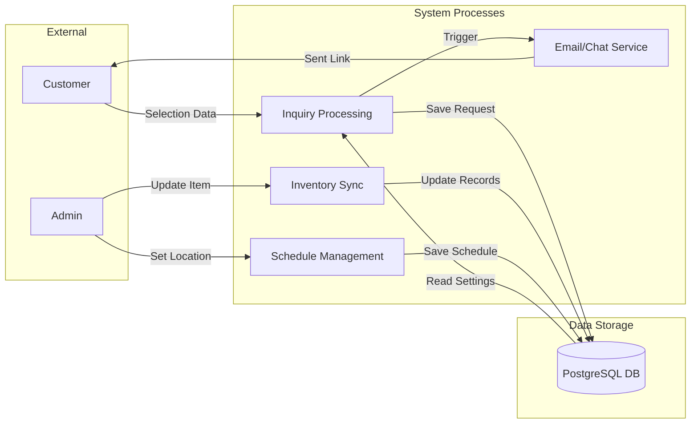
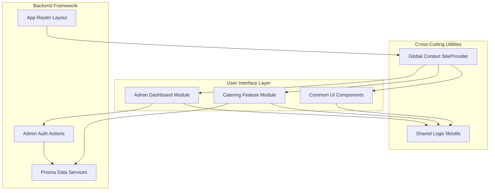

# Portfolio Technical Report: Indian Food Truck Management System

## Table of Contents
1. [Executive Summary](#executive-summary)
2. [Project Introduction](#project-introduction)
3. [System Architecture](#system-architecture)
4. [User Interface Design & Aesthetics](#user-interface-design--aesthetics)
5. [Database Architecture & Schema](#database-architecture--schema)
6. [Core Module Deep-Dives](#core-module-deep-dives)
7. [API & Integration Layer](#api--integration-layer)
8. [Testing & Quality Assurance](#testing--quality-assurance)
9. [Deployment & DevOps](#deployment--devops)
10. [Conclusion & Future Roadmap](#conclusion--future-roadmap)

---

## Executive Summary
The **Indian Food Truck Management System** is a sophisticated, full-stack enterprise solution designed to modernize mobile food operations. By integrating consumer-facing discovery tools with powerful administrative logistics, the system streamlines the catering inquiry lifecycle, automates real-time schedule publishing, and provides a premium digital presence for the business. This report details the architectural decisions, design philosophies, and engineering rigors applied to build this portfolio-standard application.

---

## Project Introduction
In the rapidly evolving mobile food industry, businesses often struggle with fragmented communication and manual logistics. This project was conceived to solve three primary pain points:
1. **Discovery**: Providing customers with a real-time "live" view of the truck's location.
2. **Catering Logistics**: Transitioning from informal emails to a structured, professional selection and quote flow.
3. **Operational Control**: Giving owners a centralized dashboard to manage menu availability, site settings, and client inquiries without touching code.

---

## System Architecture
The application is built on the **Next.js 15 App Router** architecture, leveraging server-side rendering for performance and client-side interactivity for a seamless user experience.

### Technical Stack
- **Languages**: TypeScript (Full-stack type safety)
- **Framework**: Next.js (Server Components & Actions)
- **Database**: PostgreSQL (Supabase) with Prisma ORM
- **Styling**: Tailwind CSS with custom Glassmorphism layers
- **Testing**: Vitest (Unit/Integration) & Playwright (E2E)

## System Visualizations

### 1. System Architecture Diagram
The system follows a multi-tier architecture, separating external services, the Next.js application layer, and the Supabase persistence layer.

### 2. ER (Entity Relationship) Diagram
The database schema is optimized for relational integrity and efficient querying.

### 3. Use Case Diagram
High-level interactions between specific user roles and system functionalities.

### 4. Sequence Diagram (Catering Request Flow)
Details the step-by-step logic and communication flow when a customer submits an inquiry.

### 5. Data Flow Diagram (DFD Level 1)
Illustrates how data flows between external entities, processes, and data stores.

### 6. Component Diagram
Shows the structural relationship and dependencies between major software modules.

---

## Core Module Deep-Dives

### 1. Professional Catering selection Flow
The crown jewel of the customer experience. Unlike standard forms, this module allows users to configure complex orders (e.g., "Half Tray" vs "Full Tray") with real-time feedback.
- **Logic**: Implements `minPeople` validation for event packages.
- **Persistence**: Selections are stored as JSON in the database, allowing for flexible future expansions without schema migrations.

### 2. Admin Logistics Dashboard
A secure command center for the owner.
- **Schedule Manager**: Allows for one-click deployment updates.
- **Inquiry Inbox**: A real-time chat interface that bridges the gap between the admin and the customer via secure tokens.

---

## Testing & Quality Assurance
To reach portfolio-quality reliability, a 3-layer testing strategy was implemented.

### Layers:
1. **Unit**: Verifying price formatting and phone normalization logic.
2. **Integration**: Testing Prisma CRUD operations and API response codes.
3. **E2E (Playwright)**: Full browser simulation of the catering inquiry submission and admin login flows.

### Reliability Guards:
- **Production Guard**: A custom block in the test helper specifically prevents data wipes if the suite is accidentally pointed at a production database URL (Supabase/AWS).

---

## Deployment & DevOps
The system is deployed on **Vercel** with a continuous integration pipeline.
- **CI/CD**: Automatic builds on push with TypeScript verification.
- **Cache Sync**: Implementation of `revalidatePath` ensures that admin updates are reflected on the public site within milliseconds of a database change.
- **Security**: Environment variables are managed securely at the provider level, including JWT secrets and password hashes.

---

## Conclusion & Future Roadmap
The Indian Food Truck Management System demonstrates the power of combining modern full-stack technologies with premium design and rigorous testing.

### The Road Ahead:
- **Phase 4**: Integrated online ordering and payment processing.
- **Phase 5**: SMS alerts for catering inquiries via Twilio.
- **Phase 6**: Advanced analytics dashboard surfacing sales trends and peak regional performance.

---
**Author**: Teja Mahesh Neerukonda
**Project Link**: [GitHub Repository](https://github.com/tejamahesh1433/indian-food-truck-site)
