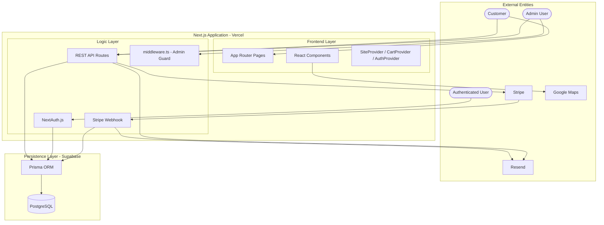
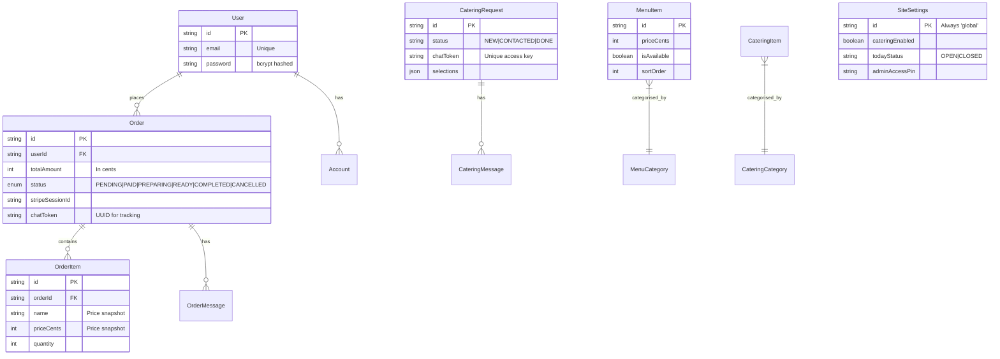
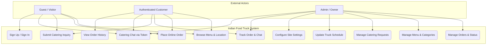
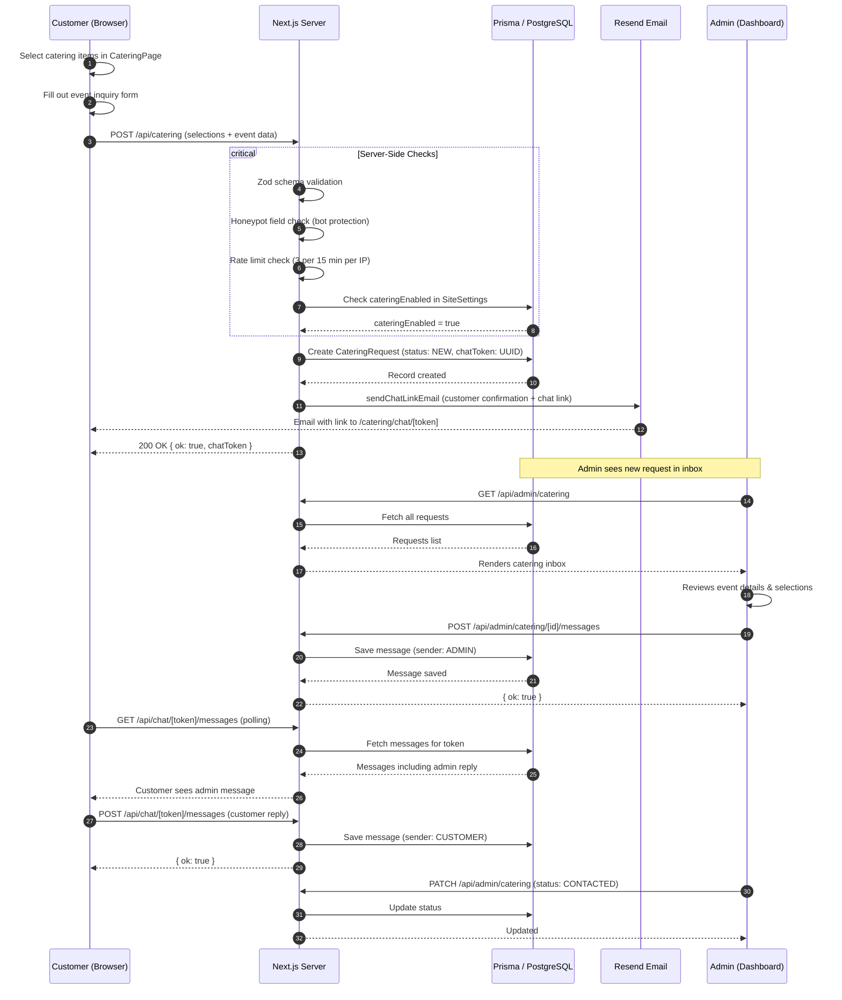
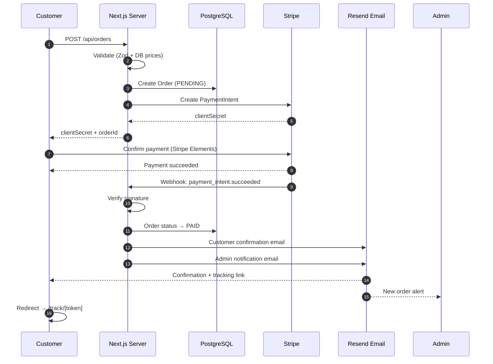
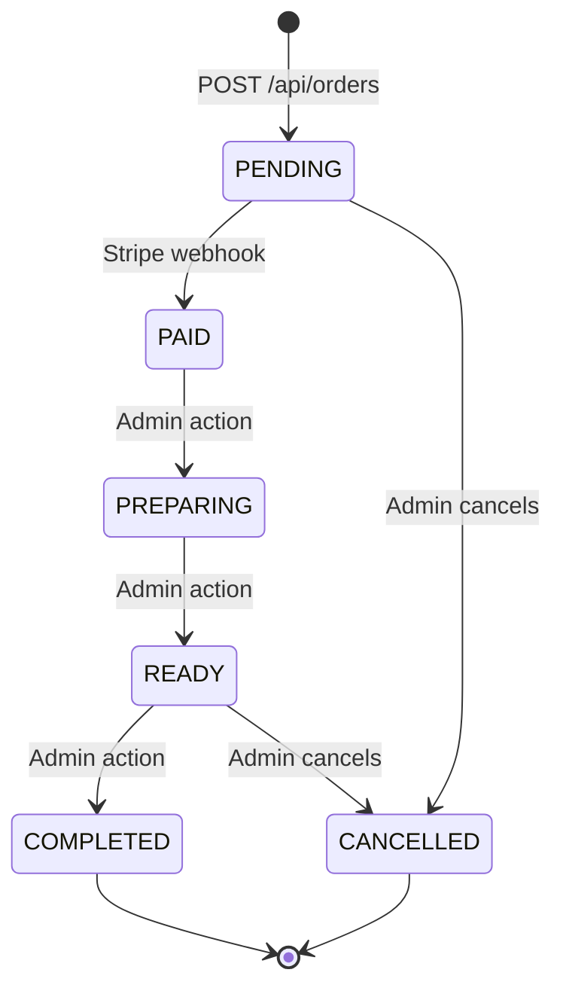

# Portfolio Technical Report: Indian Food Truck Management System

## Table of Contents
1. [Executive Summary](#executive-summary)
2. [Project Introduction](#project-introduction)
3. [System Architecture](#system-architecture)
4. [User Interface Design & Aesthetics](#user-interface-design--aesthetics)
5. [Database Architecture & Schema](#database-architecture--schema)
6. [Core Module Deep-Dives](#core-module-deep-dives)
7. [Security Architecture](#security-architecture)
8. [API & Integration Layer](#api--integration-layer)
9. [Testing & Quality Assurance](#testing--quality-assurance)
10. [Deployment & DevOps](#deployment--devops)
11. [Conclusion & Future Roadmap](#conclusion--future-roadmap)

---

## Executive Summary

The **Indian Food Truck Management System** is a sophisticated, production-ready full-stack platform designed to modernize mobile food operations. It integrates a premium consumer-facing storefront with a comprehensive admin control panel, delivering end-to-end functionality: online menu browsing, Stripe-powered ordering and payment, real-time order tracking, professional catering inquiry management, and a fully configurable business dashboard. This report details the architectural decisions, security engineering, design philosophy, and technical rigor applied throughout development.

---

## Project Introduction

In the mobile food industry, businesses struggle with fragmented communication, manual logistics, and missed revenue from customers who cannot reach the truck. This project was conceived to solve four primary pain points:

1. **Discovery**: Providing customers a real-time view of the truck's current location and schedule.
2. **Online Ordering**: Enabling direct-to-truck ordering with secure payment processing — eliminating lost sales from queue-shy customers.
3. **Catering Logistics**: Transitioning from informal emails to a structured, professional item selection and quote flow.
4. **Operational Control**: Giving owners a centralized dashboard to manage all aspects of the business without touching code.

---

## System Architecture

The application is built on the **Next.js 16 App Router** architecture, combining server-side rendering for performance with client-side interactivity for a seamless user experience.

### Technical Stack

- **Languages**: TypeScript (full-stack type safety)
- **Framework**: Next.js 16 (App Router, Server & Client Components)
- **Database**: PostgreSQL (Supabase) with Prisma ORM
- **Authentication**: NextAuth.js (customer accounts) + custom JWT (admin)
- **Payments**: Stripe (Payment Intents + Webhooks)
- **Email**: Resend (transactional emails)
- **Styling**: Tailwind CSS with custom glassmorphism layers
- **Animation**: Framer Motion + GSAP
- **Analytics**: Vercel Analytics (privacy-friendly, no cookies)
- **Testing**: Vitest (unit/integration) & Playwright (E2E)
- **Deployment**: Vercel (CI/CD on every push)

### System Architecture Diagram

---

## User Interface Design & Aesthetics

The design language is a "Premium Dark Mode" aesthetic — inspired by Indian spice colors and elevated dining experiences.

### Design System Highlights

- **Glassmorphism**: Cards styled with `bg-white/5 border border-white/10 backdrop-blur-xl` create depth and layering.
- **Spice Color Palette**: Primary CTAs in saffron orange (`#f97316`). Ambient radial glows in turmeric orange, chili red, and ginger yellow throughout `globals.css`.
- **Animation**: Framer Motion scroll-reveal animations on all page sections (fade + slide-up). GSAP powers the hero text split animation.
- **Typography**: Geist Sans variable font for clean, modern heading and body text.
- **Responsive**: Mobile-first layout using Tailwind CSS breakpoints across all pages.

---

## Database Architecture & Schema

### Entity Relationship Diagram

### Use Case Diagram

### Sequence Diagram — Catering Request Flow

### Key Design Decisions

- **Price snapshots on OrderItem**: Item prices and names are copied at order time, ensuring historical accuracy even as menu prices change.
- **Server-side price verification**: The orders API fetches live prices from the database and ignores client-submitted prices entirely, preventing cart tampering.
- **Cents-as-integers**: All monetary values stored as `Int` (cents) to eliminate floating-point precision issues.
- **Dual auth systems**: NextAuth handles customer sessions; a separate custom JWT system handles admin auth — keeping them fully isolated.
- **AdminLoginAttempt table**: Persistent rate limiting across serverless function instances (unlike in-memory maps which reset on cold starts).

---

## Core Module Deep-Dives

### 1. Online Ordering & Payment Flow

The ordering system is built around Stripe Payment Intents for a modern, reliable payment experience.

#### Order Status Lifecycle

Flow:
1. Customer adds items to cart (localStorage-persisted, auth-aware).
2. `POST /api/orders` validates the request, fetches DB prices, creates a `PENDING` order, and returns a Stripe `clientSecret`.
3. Customer completes payment in the Stripe Elements form.
4. Stripe fires `payment_intent.succeeded` to the webhook endpoint.
5. Webhook marks the order as `PAID`, sends a customer confirmation email, and sends an admin notification email.
6. Customer is redirected to `/track/[token]` for live status updates and chat.

### 2. Professional Catering Selection Flow

Unlike standard inquiry forms, this module allows customers to configure complex orders with real-time feedback before submitting.

- `CateringItemDrawer` handles "Half Tray" vs "Full Tray" pricing logic and enforces `minPeople` for packages.
- `CateringSelectionSummary` shows a running total and submits the full selection as JSON.
- On submission, a chat token is generated and emailed to the customer as a unique link to `/catering/chat/[token]`.

### 3. Admin Dashboard

A secure, feature-rich control center for managing all aspects of the business.

- **Orders module**: View paid orders, update statuses through the fulfillment lifecycle, chat with customers.
- **Menu management**: Full CRUD with drag-to-reorder, availability toggles, and bulk operations.
- **Catering inbox**: Status tracking, internal notes, and per-request chat threads.
- **Schedule manager**: Today/next-stop location, hours, notes, and saved location presets.
- **Site settings**: Global configuration including announcement banner, catering toggle, and access PIN gate.

### 4. Cart System

The `CartProvider` uses React Context with localStorage persistence. Carts are keyed by user email when authenticated, ensuring cart contents persist across sessions and switch cleanly on login/logout.

---

## Security Architecture

Security was treated as a first-class concern throughout development.

- **Admin middleware**: `src/middleware.ts` protects all `/admin`, `/truckadmin`, and `/api/admin` routes via JWT verification on every request.
- **Timing-safe comparison**: Admin password comparison uses `crypto.timingSafeEqual` with SHA-256 hashing to prevent timing attacks.
- **Database-backed rate limiting**: Admin login and PIN verification are rate-limited (5 attempts / 15 min per IP) using the `AdminLoginAttempt` table — reliable across serverless cold starts unlike in-memory solutions.
- **Server-side price verification**: Order totals are calculated entirely from database prices. Client-submitted prices are discarded.
- **Stripe webhook signature verification**: All webhook events validated via `stripe.webhooks.constructEvent` before processing.
- **Secure cookies**: Admin JWT cookies set with `httpOnly: true`, `secure: true` (production), `sameSite: lax`.
- **Zod validation**: All API endpoints validate incoming data with Zod schemas before processing.
- **Honeypot + rate limiting**: Catering form protected against bots.
- **Error boundary**: `src/app/error.tsx` catches unexpected runtime errors and shows a graceful error page.

---

## API & Integration Layer

The system exposes a comprehensive REST API across three categories:

**Public endpoints**: Menu, settings, catering submission, order creation, order tracking, chat.

**Authenticated endpoints** (NextAuth session): User order history.

**Admin endpoints** (JWT cookie): Full CRUD for menu, catering, orders, settings, saved locations.

**Webhook**: Stripe `payment_intent.succeeded` and `checkout.session.completed` handled at `/api/webhooks/stripe`.

All endpoints use Next.js Route Handlers in the App Router. No raw SQL is used — all database access goes through Prisma ORM, eliminating SQL injection risk.

---

## Testing & Quality Assurance

A 3-layer automated testing strategy ensures reliability across logic, database, and browser interactions.

Layers:
1. **Unit (Vitest)**: Price formatting, phone normalization, utility functions.
2. **Integration (Vitest)**: Prisma CRUD operations and API response codes against a test database.
3. **E2E (Playwright)**: Full browser simulation of customer ordering flow, catering submission, and admin login.

### Reliability Guards

- **Production Guard**: `tests/helpers/db.ts` aborts the test suite if it detects a production Supabase/AWS URL — preventing accidental data wipes.
- **Admin fixture**: Custom `adminPage` Playwright fixture auto-logs into the admin panel, avoiding repetitive login logic in E2E tests.
- **Database helpers**: `resetDatabase()` and `seedBasicData()` functions ensure a clean, consistent state before each test run.

---

## Deployment & DevOps

The system is deployed on **Vercel** with a continuous integration pipeline.

- **CI/CD**: Automatic builds triggered on every push to `main`. TypeScript compilation and Prisma client generation run as part of the build.
- **Build command**: `prisma generate && next build` — ensures the Prisma client is always up to date in the deployed environment.
- **Cache sync**: `revalidatePath()` called after admin mutations ensures public pages reflect changes within milliseconds without a full redeploy.
- **Environment isolation**: All secrets managed via Vercel environment variables. `.env` is gitignored and never committed.
- **SEO**: `sitemap.xml`, `robots.txt`, Open Graph meta tags, Twitter card meta, favicon, and Apple touch icon configured for production.

---

## Conclusion & Future Roadmap

The Indian Food Truck Management System delivers a complete, production-ready digital platform for a mobile food business — from first-time visitor to repeat customer, from inquiry to fulfilled order. The combination of a premium UI, a secure and scalable backend, full payment integration, and a powerful admin panel sets a high bar for what a food truck website can be.

### The Road Ahead

- **Phase 6**: Analytics dashboard with revenue trends and dish popularity charts.
- **Phase 7**: SMS order status notifications via Twilio, push notifications via Web Push API.
- **Phase 8**: Customer loyalty program with points and promo codes.
- **Phase 9**: Multi-truck support and role-based admin permissions.
- **Phase 10**: Email verification, enhanced password policies, and audit logs.

---
**Author**: Teja Mahesh Neerukonda
**GitHub**: [github.com/tejamahesh1433/indian-food-truck-site](https://github.com/tejamahesh1433/indian-food-truck-site)
