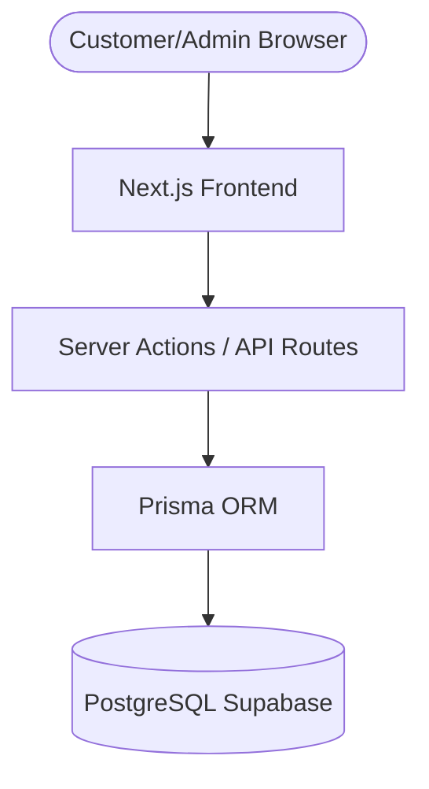

# System Architecture

## Architecture Overview

The application follows a **modern full-stack architecture**.

---

## Frontend Layer

Built using:

* Next.js
* React
* Tailwind CSS

Responsibilities:

* Rendering UI
* Handling user interactions
* Submitting forms
* Displaying menu and truck location

---

## Backend Layer

Implemented with:

* Next.js server actions
* API routes

Responsibilities:

* Process catering requests
* Update menu items
* Manage site settings
* Manage truck schedule

---

## Database Layer

Uses:

* PostgreSQL
* Prisma ORM

Responsibilities:

* store menu items
* store catering requests
* store truck schedule
* store site settings
