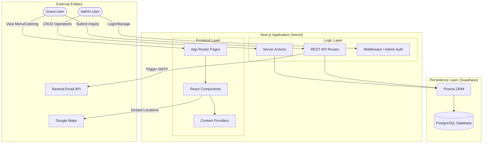

# System Architecture

## System Architecture Diagram

The Indian Food Truck Management System is built on a modern, decoupled architecture leveraging Next.js as the core application engine.

## Architectural Overview
- **Next.js (Vercel)**: Serves as the full-stack framework, handling both React rendering and server-side API logic.
- **Prisma + PostgreSQL**: Ensures type-safe data access and relational integrity for menu and catering data.
- **Context-Driven State**: The `SiteProvider` orchestrates global configuration, ensuring consistent branding across all pages.

---

## Frontend Layer

Built using:

* Next.js
* React
* Tailwind CSS

Responsibilities:

* Rendering UI
* Handling user interactions
* Submitting forms
* Displaying menu and truck location

---

## Backend Layer

Implemented with:

* Next.js server actions
* API routes

Responsibilities:

* Process catering requests
* Update menu items
* Manage site settings
* Manage truck schedule

---

## Database Layer

Uses:

* PostgreSQL
* Prisma ORM

Responsibilities:

* store menu items
* store catering requests
* store truck schedule
* store site settings
