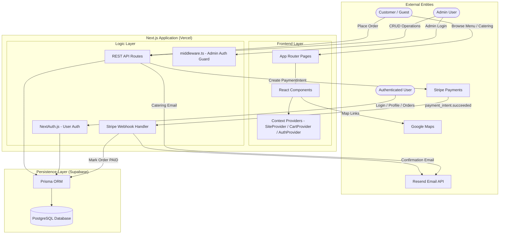

# System Architecture

## System Architecture Diagram

The Indian Food Truck Management System is built on a modern, decoupled architecture leveraging Next.js as the core application engine.

## Architectural Overview

- **Next.js 16 (Vercel)**: Full-stack framework handling both React rendering and server-side API logic via App Router.
- **Prisma + PostgreSQL (Supabase)**: Type-safe data access with relational integrity for all models.
- **NextAuth.js**: Handles customer authentication (sign up, sign in, sessions) with JWT strategy and Prisma adapter.
- **Stripe**: Processes online payments via Payment Intents. Webhook confirms payment and triggers order fulfillment.
- **Resend**: Sends transactional emails — order confirmations to customers and notifications to admin.
- **Context-Driven State**: `SiteProvider` (site settings), `CartProvider` (cart state + localStorage), `AuthProvider` (user session).
- **Admin Auth**: Separate from NextAuth — custom JWT cookie system protecting `/admin`, `/truckadmin`, and `/api/admin` routes via `middleware.ts`.

---

## Frontend Layer

Built using Next.js, React 19, and Tailwind CSS.

Responsibilities:
* Rendering UI (Server Components for data-heavy pages, Client Components for interactivity)
* Cart management with localStorage persistence and auth-aware cart switching
* Stripe Elements for secure card input on the checkout page
* Real-time order and catering chat interfaces
* Animation layers using Framer Motion and GSAP

---

## Backend Layer

Implemented with Next.js API routes.

Responsibilities:
* Process and validate online orders (Zod schema + server-side price verification from DB)
* Create Stripe PaymentIntents and handle webhook events
* Process catering requests with anti-spam (honeypot + rate limiting)
* Handle admin authentication with timing-safe comparisons and DB-backed rate limiting
* Update menu items, site settings, and truck schedule
* Send transactional emails via Resend

---

## Database Layer

Uses PostgreSQL via Prisma ORM (hosted on Supabase).

Responsibilities:
* Store menu items, categories, orders, and order items
* Store catering requests, catering items, and catering categories
* Store user accounts, sessions, and NextAuth tokens
* Store site settings as a global singleton
* Store saved truck locations
* Store admin login attempt records for rate limiting

---

## Security Architecture

* **Admin routes** protected by `middleware.ts` — JWT token verified on every request
* **User routes** protected by NextAuth session checks
* **Admin login** uses timing-safe string comparison (`crypto.timingSafeEqual`) and database-backed rate limiting (5 attempts / 15 min)
* **Stripe webhook** validated via `stripe.webhooks.constructEvent` signature check
* **Prices** verified server-side against database on every order — client-sent prices are ignored
* **Cookies** set with `httpOnly: true`, `secure: true` (production), `sameSite: lax`
